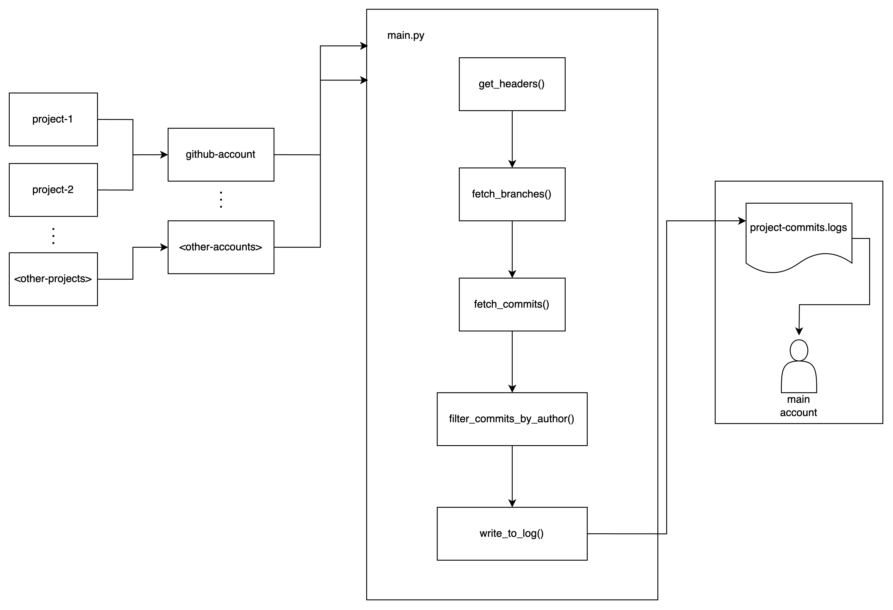

# commit-logs-automation 

This is a commit logs fetcher that retrieves commit messages made by you but commits them using another account. This way, you still receive contributions even if commits were made under a different account.

## Features
- Fetches commit messages from a repository.
- Commits them using a different GitHub account.
- Ensures your contributions are reflected in your profile.
- Fully customizable through environment variables.

## Customization
1. Add another YAML workflow file.
2. Define environment variables in the workflow.
3. Pass the variables into the script.
4. Done! The automation will handle the rest.

## Project Breakdown
